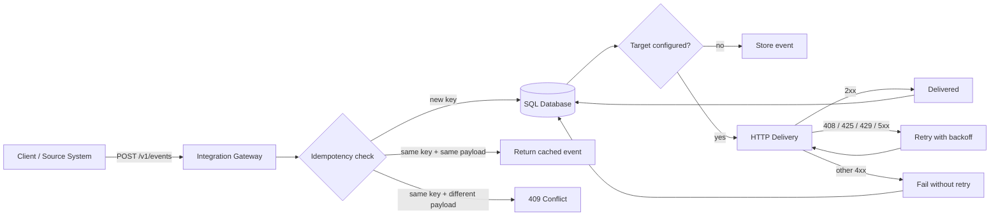

# Integration Gateway

A small production-style **FastAPI integration service** for receiving webhook events, enforcing idempotency, storing delivery state and forwarding events to another HTTP service with retry/backoff.

Built as a portfolio project around the kind of backend and integration problems that appear in CRM, automation and service-to-service workflows.

## What it demonstrates

- FastAPI REST API
- webhook ingestion
- idempotency keys and conflict detection
- deterministic payload hashing
- SQLAlchemy persistence
- outbound HTTP delivery with retry/backoff
- retryable vs non-retryable HTTP failures
- event status tracking
- correlation IDs
- health/readiness endpoints
- Docker packaging
- automated tests and CI

## Architecture



## API

### Health

```http
GET /health
```

### Receive an event

```http
POST /v1/events
Idempotency-Key: order-42-created
Content-Type: application/json
```

```json
{
  "event_type": "order.created",
  "source": "crm",
  "data": {
    "order_id": 42,
    "customer": "demo@example.com"
  }
}
```

The first request returns `202 Accepted`. Sending the same payload with the same `Idempotency-Key` returns the existing event instead of processing it twice.

Reusing the same key with a different payload returns `409 Conflict`.

### Read delivery state

```http
GET /v1/events/{event_id}
```

### Retry a failed/stored event

```http
POST /v1/events/{event_id}/retry
```

A target URL must be configured for delivery.

## Quick start

### 1. Create an environment

```bash
python -m venv .venv
```

Windows:

```powershell
.venv\Scripts\activate
```

macOS/Linux:

```bash
source .venv/bin/activate
```

### 2. Install

```bash
pip install -e ".[dev]"
```

### 3. Configure

```bash
cp .env.example .env
```

By default the gateway stores events in SQLite and does not forward them anywhere.

To enable delivery:

```env
TARGET_WEBHOOK_URL=https://example.com/webhooks/incoming
```

### 4. Run

```bash
uvicorn app.main:app --reload
```

Open:

- API: http://127.0.0.1:8000
- Swagger UI: http://127.0.0.1:8000/docs
- Health: http://127.0.0.1:8000/health

## Retry policy

Delivery is retried for temporary failures:

- network errors
- `408 Request Timeout`
- `425 Too Early`
- `429 Too Many Requests`
- `5xx` responses

Normal `4xx` responses are treated as permanent failures and are not retried.

The backoff is exponential:

```text
base_backoff * 2^(attempt - 1)
```

## Idempotency

The gateway stores:

- the `Idempotency-Key`
- a SHA-256 hash of the normalized request payload
- the event record and current delivery state

This gives three outcomes:

1. New key: create and process the event.
2. Existing key + same payload: return the original event.
3. Existing key + different payload: reject with `409 Conflict`.

## Event states

| State | Meaning |
|---|---|
| `stored` | Event was accepted but no target is configured |
| `pending` | Event is ready for delivery |
| `delivered` | Target returned a successful 2xx response |
| `failed` | Delivery failed after applying retry rules |

## Tests

```bash
pytest
```

The test suite covers:

- health endpoint
- idempotent replay
- idempotency conflict
- retry endpoint behavior
- transient delivery failure followed by success
- non-retryable client errors

## Docker

```bash
docker build -t integration-gateway .
docker run --rm -p 8000:8000 --env-file .env integration-gateway
```

## Stack

- Python 3.12
- FastAPI
- Pydantic Settings
- SQLAlchemy 2
- HTTPX
- Pytest
- Ruff
- Docker
- GitHub Actions

## Why this project

Integration work is rarely just "call an API".

Reliable integrations need to handle duplicate requests, temporary outages, permanent errors, persistence, retries, debugging and traceability. This project isolates those concerns in a small codebase that can be read and tested quickly.

---

Developer: [automation-333](https://github.com/automation-333)
